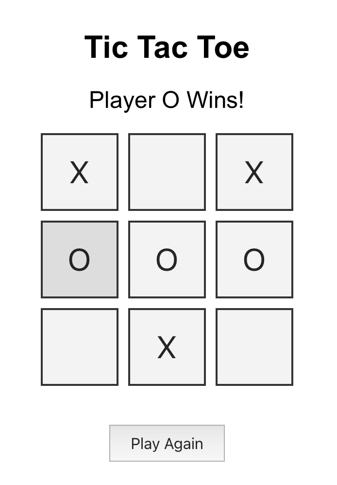

# 🎮 Tic Tac Toe – React Edition

This is a responsive, modern web version of the classic Tic Tac Toe game built using React. It features clean styling, game state management, win/tie detection, and the ability to play again without reloading.

## 🚀 Live Demo

👉 [Click here to play](https://your-deployment-url.netlify.app)  
(Deploy this to [Netlify](https://www.netlify.com/) or [Vercel](https://vercel.com/) and update the link)

---

## 🛠️ Tech Stack

- ⚛️ React (functional components + hooks)
- 💅 CSS for layout and styling
- 🔁 State management with `useState`
- ✅ Responsive layout

---

## 🎮 Features

- 2-player local gameplay
- Real-time game board updates
- Win detection for rows, columns, and diagonals
- Tie/draw detection
- Replay button after win/tie
- Mobile-friendly UI

---

## 📸 Preview



> 📸 Screenshot of game!

---

## 🧑‍💻 How to Run Locally

```bash
git clone https://github.com/TrishaAndres/tic-tac-toe-react.git
cd tic-tac-toe-react
npm install
npm start
